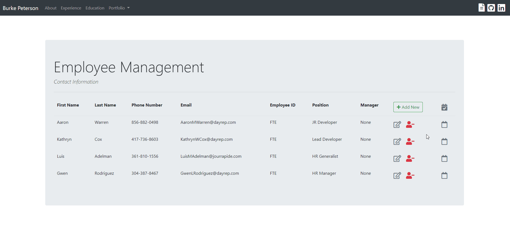

Visit the website at https://www.burkepeterson.com/

### Table of Contents

- [Description](#description)
- [How To Use](#how-to-use)
- [Author Info](#author-info)

---

## Description

Hello, My name is Burke Peterson and this is the GitHub Repository for the website https://www.burkepeterson.com.

### Highlights
#### A Stock Portfolio Watchlist Application
This site allows users to search for stocks based on their ticker and view a few of the top moving stocks along with some basic financial information about them. By logging in, users are able to edit and view their own personal watchlist.
<i>
- Built with Django
- Gathers data and news stories from [Yahoo Finance](https://finance.yahoo.com/)
- User login:
  - Google
  - Local
- SQLite DB to save user watchlist's
- [Bokeh](https://bokeh.org/) visualization for candlestick chart of stock price
</i>

#### An Employee Contact Information Management Application
This site allows users to manage employee contact information. They are able to create a new employee, view and update their contact information. As well as delete the employee. They are able to select the employees manager from a list of managers.
<i>
- Built with Django
- Uses a form to collect employee information
- SQLite DB to store employees
- Manager selection can only be an employee who is a manager
</i>

#### Technologies

- [Django](https://www.djangoproject.com/)
- [Bootstrap 4](https://getbootstrap.com/)
- [Google OAuth API](https://developers.google.com/identity/protocols/OAuth2)
- [Bokeh](https://bokeh.org/)
- [SQLite](https://sqlite.org/index.html)

[Back To The Top](#read-me-template)

---

## How To Use

#### Installation
<i>(This project was built with Python 3.7)</i>

1. Clone repository: 
`git clone https://github.com/burkepeterson/burke_peterson_portfolio_website.git`

2. Install requirements: 
`pip install -r requirements.txt`

3. Run migrations to create Database: 
`python manage.py migrate`

4. Start a development web server on the local machine: 
`python manage.py runserver`

5. Go to LocalHost within browser to see the website: 
http://127.0.0.1:8000/

<i>At this point the project will function as designed with the exception of Google Login.
   You will still be able to login locally and utilize full functionality within the site.
   If you would like to enable Google Login, continue on to the next steps. 
   </i>`
##### Google OAuth for Social Account Login
6. Create the OAuth key
   - Go to [Google Developers console](https://console.developers.google.com/)
   - navigate to credentials 
   - click on Create Credentials 
   - click on OAuth client ID
   - Choose Web application
   - Give it a name 
   - Put http://127.0.0.1:8000 for Authorized JavaScript origins and Authorized redirect URIs 
7. Navigate to project main folder and run this command:  
  `python manage.py createsuperuser`
  
8. Set up a username and password for the superuser
9. Navigate to http://127.0.0.1:8000/admin and login with the superuser details
10. Under Social applications click add
11. Fill in the form provided
    - Choose provider Google
    - Give it a name like Google API
    - Fill in the Client ID from the client id at console.developers.google.com
    - Fill in the Secret key from console.developers.google.com
    - Double click example.com to make it a choosen site
    - Click save

You are now able to use Google Sign in within the app

[Back To The Top](#read-me-template)

---
## Author Info

- Website - [Portfolio Website](https://www.burkepeterson.com)
- Resume - [Burke Peterson Resume](https://www.burkepeterson.com/static/Burke_Peterson_Resume.pdf)

[Back To The Top](#read-me-template)
